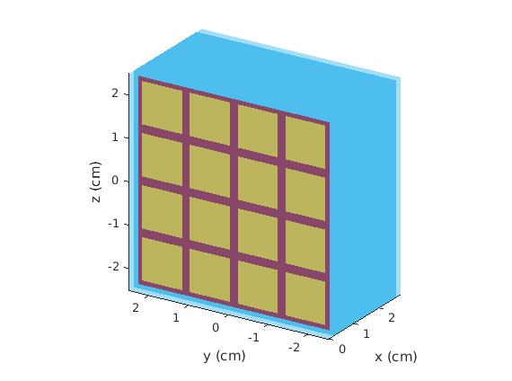
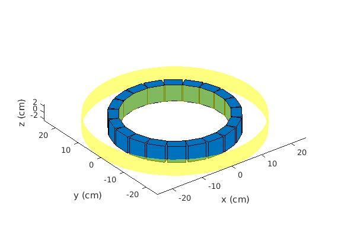
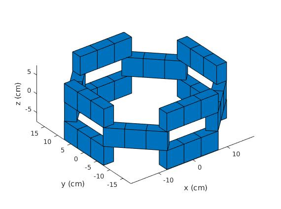

# SimSET-Visualization

This repo contains code to generate 3D visualizations from the three parameter files needed to configure a block-detector system in SimSET. The three parameter files are of the individual block-detectors, the arrangement of block-detectors that form rings, and the arrangement of rings that make the tomograph. Details on the parameter files can be found in (2). The functions `display_block`, `display_ring`, and `display_tomo` are the corresponding visualization functions.

All of the visualizations can be used with the output of the parameter file definition scripts described in (3). In addition, the visualizations can be used by reading and parsing the parameter files themselves by calling `read_ring` and `read_tomo`. At the moment, block-parameter files cannot be read, so the output of `define_regular_block` or `define_block` is needed to use `display_block`.

Since the visualizations build upon each other, there are requirements of what files must be available to display each component. The block-detector is the base unit of the visualizations and as such only depends on the given input. The ring visualization however requires the block-parameter files of the blocks used in the ring to be in the same directory. Similarly, the tomograph visualization requires the ring-parameter files of the rings used in the tomograph, and the block-parameter files of the blocks used in the rings all be in the same directory.

However, anytime `display_ring` or `display_tomo` is called on a ring or the rings contained in a tomograph, the visualization data for each ring is saved in a mat-file of the same filename as the ring-parameter filename. When the ring-visualization data is required when visualizing the ring or visualizing a tomograph containing the ring, the mat-file will be retrieved instead of reading and processing the parameters from scratch. This alternative takes significantly less computational work and keeps the input arguments simple.

If you change a block or ring parameter file, but the ring or tomograph visualization still shows the ring prior to your changes, you may delete the mat-file for the ring and reproduce the mat-file when visualizing the ring or a tomograph containing the ring.

## Usage and Examples

### Block-Detector

The block must be defined using either `define_regular_block` or `define_block` which can be found at (2).

```

example_block = define_regular_block();

display_block(example_block);

```



### Ring

The ring visualization takes two arguments, a struct containing the bounding dimensions of the ring and a struct containing the arrangement of the blocks. The bounding radial of the ring are also shown by two concentric yellow cylinders.

```

[ring, blocks] = read_ring(`example.ringparms`);

display_ring(ring, blocks);

```



### Tomograph

The tomograph shown below is based on the files from the examples at (3).

```
tomo = read_tomo(`example.detparms`);

display_tomo(tomo);

```



## Resources

1. See [the SimSET webpage](http://depts.washington.edu/simset/html/simset_main.html).

2. See [an explanation of how the parameter files are configured](http://depts.washington.edu/simset/html/user_guide/detector_modelling.html#block_PET_SPECT.configuring).

3. See [documentation and examples of parameter file definitions](http://depts.washington.edu/simset/html/user_guide/block_detector_definition.html).
